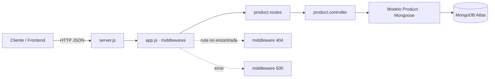

# portfolio-dina
A fully responsive graphic design portfolio website with a content management system to keep the portfolio up-to-date.

# API REST · Catálogo de productos (esqueleto de ejemplo)

API RESTful de ejemplo construida con **Node.js + Express + MongoDB (Mongoose)**. Es el
**esqueleto de referencia** de la PEC 3: muestra la estructura esperada (rutas, controladores,
modelos y middlewares 404/500). Adáptalo a tu propio proyecto.

## Arquitectura



> GitHub renderiza este bloque ```mermaid``` como un diagrama. Inclúyelo en tu propio README.

## Estructura

```
api-skeleton/
├── server.js                 # arranque (local) y export para Vercel
├── vercel.json               # configuración de despliegue
├── .env.example              # variables de entorno necesarias
├── requests.http             # pruebas de la API
└── src/
    ├── app.js                # configura Express y los middlewares
    ├── config/db.js          # conexión a MongoDB Atlas
    ├── models/               # User.js, Product.js (esquemas Mongoose)
    ├── controllers/          # lógica del CRUD
    ├── routes/               # endpoints de la API
    └── middlewares/          # notFound (404) y errorHandler (500)
```

## Instalación y ejecución (local)

```bash
npm install
cp .env.example .env     # y rellena MONGODB_URI con tu cadena de Atlas
npm run dev              # o: npm start
```

La API quedará en `http://localhost:4000`.

## Variables de entorno

| Variable | Descripción |
|----------|-------------|
| `PORT` | Puerto local (por defecto 4000). |
| `MONGODB_URI` | Cadena de conexión de MongoDB Atlas. |

## Endpoints

| Método | Ruta | Descripción |
|--------|------|-------------|
| GET | `/` | Comprobación de estado. |
| GET | `/api/products` | Lista todos los productos. |
| GET | `/api/products/:id` | Obtiene un producto. |
| POST | `/api/products` | Crea un producto. |
| PUT | `/api/products/:id` | Actualiza un producto. |
| DELETE | `/api/products/:id` | Elimina un producto. |

Todas las respuestas son **JSON**. Los errores se gestionan con los middlewares **404**
(ruta no encontrada) y **500** (gestor central de errores).

## Despliegue en Vercel

1. Sube el proyecto a un repositorio de **GitHub**.
2. Importa el repositorio en **Vercel**.
3. Añade la variable de entorno `MONGODB_URI` en **Settings → Environment Variables**.
4. Despliega y comprueba que la URL pública responde y se conecta a **MongoDB Atlas**.

> Pruebas (obligatorias): usa `requests.http` (extensión REST Client de VS Code) y la colección
> `catalogo.postman_collection.json` (impórtala en Postman o Thunder Client).
