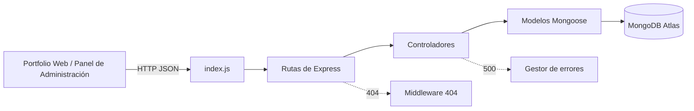

# Portfolio Dina API

API REST desarrollada con **Node.js, Express.js, MongoDB Atlas y Mongoose** para gestionar el contenido de un portfolio de diseño gráfico. La API permite administrar proyectos, categorías y la configuración general del sitio mediante un sistema de gestión de contenido (CMS), facilitando la actualización del portfolio sin necesidad de modificar el frontend.

## Arquitectura



## Estructura del proyecto

```text
portfolio-dina/
├── config/
│   └── db.js                     # Conexión a MongoDB Atlas
├── controllers/
│   ├── category-controller.js
│   ├── project-controller.js
│   └── siteSettings-controller.js
├── middleware/
│   ├── auth.js
│   ├── logger.js
│   ├── not-found.js
│   └── server-error.js
├── models/
│   ├── Category.js
│   ├── Project.js
│   ├── SiteSettings.js
│   └── User.js
├── routes/
│   ├── categoryRouter.js
│   ├── projectRouter.js
│   └── siteSettingsRouter.js
├── index.js                      # Punto de entrada de la aplicación
├── package.json
├── .gitignore
├── env.example
└── .env
```

## Instalación y ejecución en local

```bash
npm install
npm run dev
```

La API estará disponible en:

```
http://localhost:3000
```

## Variables de entorno

| Variable | Descripción |
|----------|-------------|
| `PORT` | Puerto utilizado en desarrollo local (por defecto: 3000). |
| `MONGO_URI` | Cadena de conexión a MongoDB Atlas. |
| `GOOGLE_CLIENT_ID` | Identificador de cliente para Google OAuth. |
| `GOOGLE_CLIENT_SECRET` | Clave secreta para Google OAuth. |

## Endpoints

### Proyectos

| Método | Ruta | Descripción |
|--------|------|-------------|
| GET | `/projects` | Obtiene todos los proyectos del portfolio. |
| GET | `/projects/:id` | Obtiene un proyecto por su ID. |
| POST | `/projects` | Crea un nuevo proyecto. |
| PUT | `/projects/:id` | Actualiza un proyecto existente. |
| DELETE | `/projects/:id` | Elimina un proyecto. |

### Categorías

| Método | Ruta | Descripción |
|--------|------|-------------|
| GET | `/categories` | Obtiene todas las categorías. |
| GET | `/categories/:id` | Obtiene una categoría por su ID. |
| POST | `/categories` | Crea una nueva categoría. |
| PUT | `/categories/:id` | Actualiza una categoría. |
| DELETE | `/categories/:id` | Elimina una categoría. |

### Configuración del sitio

| Método | Ruta | Descripción |
|--------|------|-------------|
| GET | `/site-settings` | Obtiene la configuración general del sitio web. |
| PUT | `/site-settings/:id` | Actualiza la configuración del sitio. |

### Usuarios

| Método | Ruta | Descripción |
|--------|------|-------------|
| POST | `/users/login` | Autenticación del administrador mediante Google OAuth. |

Todas las respuestas de la API se devuelven en formato **JSON**. Los errores de validación, recursos inexistentes y errores internos del servidor se gestionan mediante middlewares específicos para garantizar respuestas consistentes.

## Despliegue en Vercel

1. Subir el proyecto a un repositorio de **GitHub**.
2. Importar el repositorio en **Vercel**.
3. Configurar las variables de entorno necesarias:
   - `MONGO_URI`
   - `GOOGLE_CLIENT_ID`
   - `GOOGLE_CLIENT_SECRET`
4. Desplegar la aplicación y comprobar que la API pública responde correctamente y se conecta a **MongoDB Atlas**.

## Pruebas

La API ha sido probada mediante:

- Una colección de **Postman** (`Allison-portfolio.postman_collection.json`).

Las pruebas incluyen las operaciones CRUD para proyectos, categorías y configuración del sitio.